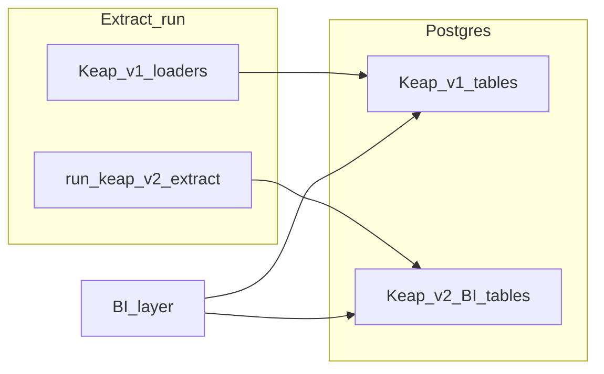

# Keap REST v2 BI (PostgreSQL extension)

This folder describes how **Keap REST API v2** data should be **inventoried**, **modeled**, and **extracted** alongside the existing **v1** Keap pipeline so BI tools can use v2-only or v2-richer resources (for example companies, automations, contact links, expanded campaign structure, and discount catalogs) in the same database as the current CRM and order extract.

v1 remains the **baseline** for entities already loaded via [`KeapClient`](../../src/api/keap_client.py) and [`DataLoadManager.load_all_data`](../../src/scripts/load_data_manager.py). v2 work is **phased**: catalog first, then vertical slices, then expansion per priority.

## Documents

| Document | Purpose |
|----------|---------|
| [01-scope-and-requirements.md](01-scope-and-requirements.md) | Scope, OAuth scopes, PII, rate limits, exclusions |
| [02-schema-design.md](02-schema-design.md) | Table naming, PK/FK to v1 keys, upserts, optional `raw_payload` |
| [03-extract-integration.md](03-extract-integration.md) | `run_keap_v2_extract`, load order, checkpoints, CLI |
| [04-bi-reporting-and-joins.md](04-bi-reporting-and-joins.md) | Source-of-truth matrix, joins between v2 tables and v1 facts |
| [05-api-client-and-pagination.md](05-api-client-and-pagination.md) | Host/token spike, shared HTTP layer, `KeapV2Client` vs official SDK, pagination |

## Appendix A: v2 GET endpoint inventory

Machine-readable list derived from the [Keap v2 Python SDK README](https://raw.githubusercontent.com/infusionsoft/keap-sdk/main/sdks/v2/python/README.md) (OpenAPI-generated):

- [keap-v2-get-endpoints-inventory.csv](keap-v2-get-endpoints-inventory.csv)

Columns include heuristic flags for overlap with existing v1 extract domains (`contacts`, `orders`, `products`, etc.). Treat `v1_domain_overlap` as **indicative** only; final sourcing decisions belong in [04-bi-reporting-and-joins.md](04-bi-reporting-and-joins.md).

### Regenerating the CSV

1. Download the upstream README (same URL as above), for example to `/tmp/keap-v2-readme.md`.
2. Run [keap-v2-inventory-regenerate.py](keap-v2-inventory-regenerate.py):  
   `python3 documentation/bau/sprint-01/keap-v2-inventory-regenerate.py /tmp/keap-v2-readme.md`  
   Optional second argument: output CSV path. The script extracts lines matching the SDK endpoint table (`*Api*` | `**GET**` | `/rest/v2/...`).

## Phase roadmap (implementation)

1. **Spike:** Confirm OAuth token against v2 hosts; document pagination fields (see [05-api-client-and-pagination.md](05-api-client-and-pagination.md)).
2. **Foundation:** Shared authenticated HTTP layer; `KeapV2Client` (or SDK wrapper) with cursor pagination.
3. **Vertical slices:** One or two high-value resources end-to-end (migrations, mappers, extract, documented joins).
4. **Expand:** Walk the inventory by BI priority; avoid duplicating v1 grain unless deliberately cutting over.

## Architecture (high level)

## Related project docs

- [Stripe sprint-01 (pattern reference)](../stripe/sprint-01/README.md)
- [Keap REST API v2](https://developer.infusionsoft.com/docs/restv2/)
- [Keap SDK (v2 OpenAPI clients)](https://github.com/infusionsoft/keap-sdk/tree/main/sdks/v2)
