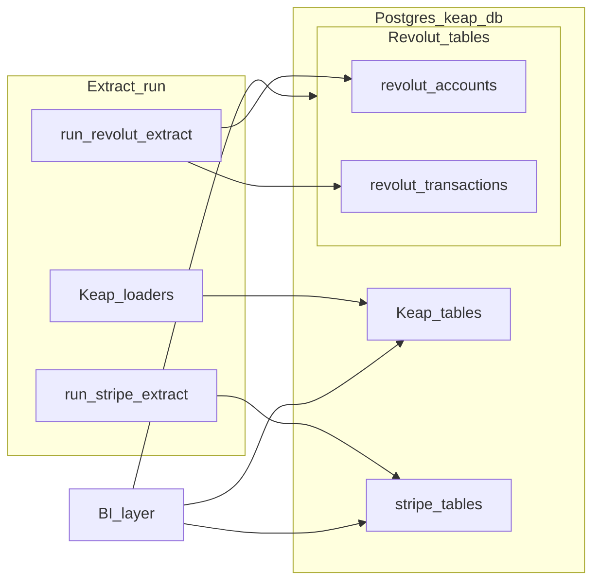

# Revolut BI (PostgreSQL extension)

This folder describes how **Revolut Business** account and transaction data should be modeled in PostgreSQL and loaded alongside the existing Keap extract (and optional Stripe) so reporting tools can use **accepted card and payment-like activity**, **full transaction history**, and **fees/charges** in the same database as CRM and order data.

**`revolut_transactions`** is the primary **transaction fact** at the grain returned by the Revolut Business API. **`revolut_accounts`** is the **account dimension** (wallets and business accounts) used to scope lists and dashboards. Keap remains the source for contacts, orders, and internal payment records where applicable; Revolut is the source for banking and card-acquiring movements as exposed by the API.

## Documents

| Document | Purpose |
|----------|---------|
| [01-scope-and-requirements.md](01-scope-and-requirements.md) | Business and solution-architecture requirements, scope, sync policy, idempotency, security |
| [02-schema-design.md](02-schema-design.md) | `revolut_*` tables, columns, indexes, relationships |
| [03-extract-integration.md](03-extract-integration.md) | Extract orchestration, checkpoints, load order, CLI alignment |
| [04-bi-reporting-and-joins.md](04-bi-reporting-and-joins.md) | Source-of-truth matrix, accepted-payments definition, example SQL, multi-gateway cautions |
| [05-access-keys-and-credentials.md](05-access-keys-and-credentials.md) | Certificates, JWT client assertion, tokens, environment variables, rotation |

## Explicit exclusions

The following are **not** targeted by this documentation milestone (they may be added later):

- **Initiating** payments, transfers, or payouts via API (this package is **read-only** extract for BI)
- **Open Banking / PSD2** consent flows as a separate product surface, unless the same Revolut Business application is extended deliberately
- **Normalized counterparty master data** beyond what the transaction payload provides (unless a follow-on design adds dimensions)
- **Real-time** ingestion-only architecture: batch extract with optional future webhooks is assumed unless specified otherwise

## Architecture (high level)

## Related project docs

- [Database design (Keap core)](../04-database-design.md)
- [Data extraction design](../03-data-extraction-design.md)
- [Security considerations](../06-security-considerations.md)
- [Stripe BI (PostgreSQL extension)](../stripe/README.md)

## Official Revolut references

- [Revolut Business API](https://developer.revolut.com/docs/business/business-api/)
- [Transactions](https://developer.revolut.com/docs/business/transactions)
- [Retrieve a list of transactions](https://developer.revolut.com/docs/business/get-transactions)

Verify endpoint paths, query parameters, and auth steps against current documentation when implementing; APIs evolve over time.
