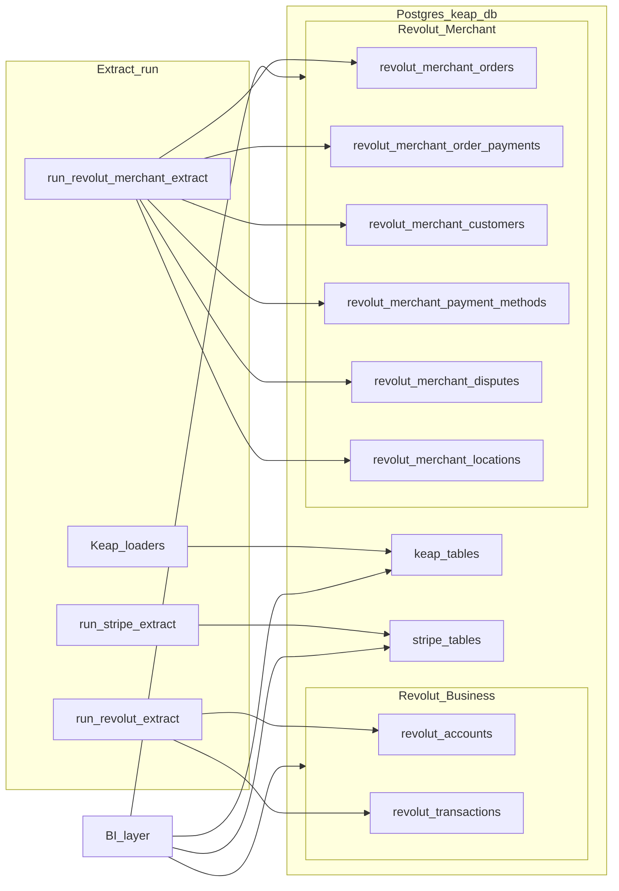

# Revolut Merchant API BI Extract — Sprint 02

This sprint extends the data warehouse with **Revolut Merchant API** entities. Sprint-01 covered the **Revolut Business API** (banking accounts and transactions). Sprint-02 is a separate API surface exposing e-commerce operations: orders, customers, payment methods, disputes, and locations.

**`revolut_merchant_orders`** is the primary **order fact** at the grain of one Revolut merchant order. **`revolut_merchant_order_payments`** captures individual payment attempts against an order. **`revolut_merchant_customers`** and **`revolut_merchant_payment_methods`** are supporting dimensions. **`revolut_merchant_disputes`** is a risk/chargeback fact. **`revolut_merchant_locations`** is a small store/terminal dimension.

## Documents

| Document | Purpose |
|----------|---------|
| [01-scope-and-requirements.md](01-scope-and-requirements.md) | Business objectives, Merchant API scope, entities in/out, idempotency, security |
| [02-schema-design.md](02-schema-design.md) | All 6 `revolut_merchant_*` tables, columns, indexes, relationships |
| [03-extract-integration.md](03-extract-integration.md) | Orchestration, load order, sync strategies, fan-out pattern, checkpoints, CLI |
| [04-bi-reporting-and-joins.md](04-bi-reporting-and-joins.md) | Source-of-truth matrix, accepted payment definition, example SQL, cross-system joins |
| [05-access-keys-and-credentials.md](05-access-keys-and-credentials.md) | API key setup, environment variables, sandbox vs production, rotation |

## Explicit exclusions

- **Webhooks** (`/api/webhooks`): configuration metadata, no BI value — excluded.
- **Write operations**: this package is read-only extract. No order creation, refunds, or dispute responses via API.
- **Real-time ingestion**: batch extract on a scheduled interval is assumed.
- **Revolut Business API**: accounts and transactions remain in `revolut_accounts` / `revolut_transactions` from Sprint-01 and are not modified here.

## Architecture (high level)

## Key differences from Sprint-01

| Dimension | Sprint-01 (Business API) | Sprint-02 (Merchant API) |
|-----------|--------------------------|--------------------------|
| API surface | `https://b2b.revolut.com/api/1.0` | `https://merchant.revolut.com/api` |
| Authentication | OAuth2 + JWT client assertion (RS256) | Static Bearer API key |
| Entities | Accounts, Transactions | Orders, Customers, Payment Methods, Disputes, Locations |
| Pagination | Date-range cursor on `created_at` | Time-based + per-resource fan-out |
| Env var prefix | `REVOLUT_*` | `REVOLUT_MERCHANT_*` |

## Official Revolut references

- [Revolut Merchant API](https://developer.revolut.com/docs/merchant/merchant-api)
- [Orders](https://developer.revolut.com/docs/merchant/orders)
- [Customers](https://developer.revolut.com/docs/merchant/customers)
- [Disputes](https://developer.revolut.com/docs/merchant/disputes)
- [Webhooks](https://developer.revolut.com/docs/merchant/webhooks)

Verify endpoint paths, query parameters, and auth steps against current documentation when implementing; APIs evolve over time.
