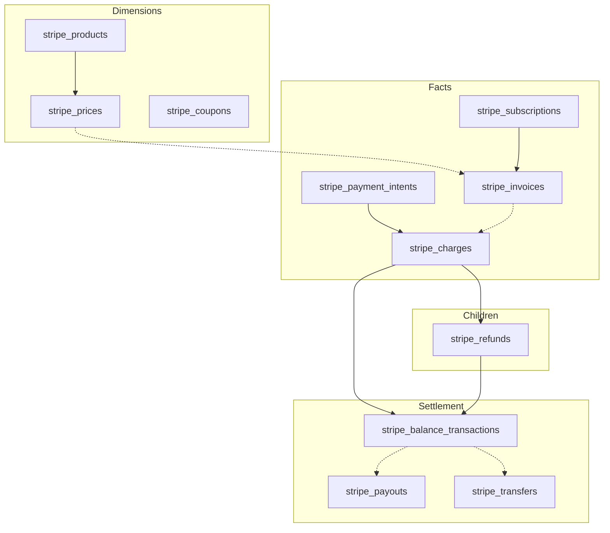

# 2. Schema design (Stripe BI)

## 2.1 Design principles

- **`stripe_charges` is the primary payment-attempt fact**; other tables add subscription, invoice, intent, catalog, settlement, and refund-line grains without duplicating Keap.
- **No foreign keys to Keap** unless the organization standardizes metadata or external ids; joins to Keap remain **logical** and optional (see [04-bi-reporting-and-joins.md](04-bi-reporting-and-joins.md)).
- **Stripe cross-table links** are stored as nullable **`TEXT`** columns (Stripe ids), not PostgreSQL FK constraints to Stripe tables, unless you later enforce them for integrity.
- **Table prefix**: `stripe_` avoids confusion with Keap’s `order_payments`, `order_transactions`, and Keap `subscriptions`.
- **Common optional columns** on all tables: `metadata` `JSONB`, `raw_payload` `JSONB`, `loaded_at`, `updated_at`; **Connect**: `stripe_account_id` where applicable.

## 2.2 Primary payment fact: `stripe_charges`

**Primary key**: `id` — `TEXT` or `VARCHAR`, Stripe charge id (`ch_...`).

### Core columns (map from Stripe Charge)

| Column | Purpose |
|--------|---------|
| `id` | Stripe charge id (PK) |
| `amount` | Amount in the smallest currency unit (integer) |
| `amount_refunded` | Refunded amount in smallest currency unit |
| `currency` | Three-letter ISO code (lowercase in Stripe) |
| `created` | Charge creation time as `timestamptz` (UTC) |
| `customer_id` | Stripe Customer id (`cus_...`), nullable |
| `invoice_id` | Stripe Invoice id (`in_...`), nullable |
| `payment_intent_id` | PaymentIntent id (`pi_...`), nullable |
| `balance_transaction_id` | Balance transaction id (`txn_...`), nullable if not expanded or absent |
| `description` | Human-readable description, nullable |
| `receipt_email` | Email on the charge, nullable |
| `paid` | Whether the charge succeeded |
| `refunded` | Whether the full amount was refunded |
| `status` | e.g. `succeeded`, `pending`, `failed` |
| `failure_code` | Nullable |
| `failure_message` | Nullable |
| `livemode` | Test vs live charge |

### Connect (optional)

| Column | Purpose |
|--------|---------|
| `stripe_account_id` | Connected account id when using Connect; null otherwise |

### BI-oriented and ETL columns

| Column | Purpose |
|--------|---------|
| `metadata` | `JSONB` — correlation keys (e.g. Keap ids if set in Stripe) |
| `raw_payload` | Optional `JSONB` — full API object; restrict access / retention |
| `loaded_at` | First insert by this pipeline |
| `updated_at` | Last update by this pipeline |

### Indexes (`stripe_charges`)

- `(created DESC)` — time-series and incremental debugging
- `(customer_id)` — customer dashboards
- `(status)` — failed vs succeeded
- `GIN (metadata)` if filtering on keys in SQL

## 2.3 Dimensions: `stripe_products`, `stripe_prices`, `stripe_coupons`

### `stripe_products`

**PK**: `id` (`prod_...`).

| Column | Purpose |
|--------|---------|
| `id` | Product id (PK) |
| `name` | Display name |
| `description` | Nullable |
| `active` | Whether the product is available |
| `default_price_id` | Nullable `price_...` |
| `metadata` | `JSONB` |
| `raw_payload` | Optional `JSONB` |
| `stripe_account_id` | Connect; nullable |
| `loaded_at` / `updated_at` | ETL housekeeping |

**Indexes**: `(active)`, `(created DESC)` if `created` is stored; `GIN (metadata)` if queried.

### `stripe_prices`

**PK**: `id` (`price_...`).

| Column | Purpose |
|--------|---------|
| `id` | Price id (PK) |
| `product_id` | `prod_...`, nullable if API allows orphan context |
| `currency` | ISO code |
| `unit_amount` | Nullable (smallest currency unit) |
| `type` | e.g. `one_time`, `recurring` |
| `recurring_interval` | Nullable (e.g. `month`) |
| `recurring_interval_count` | Nullable |
| `active` | Boolean |
| `metadata` | `JSONB` |
| `raw_payload` | Optional `JSONB` |
| `stripe_account_id` | Connect; nullable |
| `loaded_at` / `updated_at` | ETL housekeeping |

**Indexes**: `(product_id)`, `(active)`, `GIN (metadata)` if needed.

### `stripe_coupons`

**PK**: `id` (`coupon_...` or documented id format).

| Column | Purpose |
|--------|---------|
| `id` | Coupon id (PK) |
| `name` | Nullable |
| `percent_off` | Nullable |
| `amount_off` | Nullable (smallest currency unit) |
| `currency` | Nullable |
| `duration` | e.g. `once`, `repeating`, `forever` |
| `duration_in_months` | Nullable |
| `valid` / `times_redeemed` / `max_redemptions` | As needed for reporting |
| `metadata` | `JSONB` |
| `raw_payload` | Optional `JSONB` |
| `stripe_account_id` | Connect; nullable |
| `loaded_at` / `updated_at` | ETL housekeeping |

**Indexes**: `(created DESC)` if stored; `GIN (metadata)` if needed.

## 2.4 Facts: `stripe_payment_intents`, `stripe_invoices`, `stripe_subscriptions`

### `stripe_payment_intents`

**PK**: `id` (`pi_...`).

| Column | Purpose |
|--------|---------|
| `id` | PaymentIntent id (PK) |
| `amount` | Intended amount (smallest unit) |
| `amount_received` | Nullable |
| `currency` | ISO code |
| `created` | `timestamptz` |
| `customer_id` | Nullable `cus_...` |
| `invoice_id` | Nullable `in_...` |
| `status` | e.g. `requires_payment_method`, `succeeded`, `canceled` |
| `latest_charge_id` | Nullable `ch_...` |
| `metadata` | `JSONB` |
| `raw_payload` | Optional `JSONB` |
| `stripe_account_id` | Connect; nullable |
| `loaded_at` / `updated_at` | ETL housekeeping |

**Indexes**: `(created DESC)`, `(customer_id)`, `(status)`, `(latest_charge_id)`, `GIN (metadata)` if needed.

### `stripe_invoices`

**PK**: `id` (`in_...`).

| Column | Purpose |
|--------|---------|
| `id` | Invoice id (PK) |
| `customer_id` | Nullable `cus_...` |
| `subscription_id` | Nullable `sub_...` |
| `status` | e.g. `draft`, `open`, `paid`, `void` |
| `currency` | ISO code |
| `amount_due` / `amount_paid` / `total` | As integers in smallest unit (map from API fields) |
| `created` | `timestamptz` |
| `period_start` / `period_end` | Nullable, for subscription invoices |
| `charge_id` | Nullable `ch_...` if present on object |
| `payment_intent_id` | Nullable `pi_...` |
| `metadata` | `JSONB` |
| `raw_payload` | Optional `JSONB` (line items often nested here unless a follow-on `stripe_invoice_line_items` table exists) |
| `stripe_account_id` | Connect; nullable |
| `loaded_at` / `updated_at` | ETL housekeeping |

**Indexes**: `(created DESC)`, `(customer_id)`, `(subscription_id)`, `(status)`, `GIN (metadata)` if needed.

### `stripe_subscriptions`

**PK**: `id` (`sub_...`).

| Column | Purpose |
|--------|---------|
| `id` | Subscription id (PK) |
| `customer_id` | `cus_...` |
| `status` | e.g. `active`, `canceled`, `past_due` |
| `current_period_start` / `current_period_end` | `timestamptz` |
| `cancel_at_period_end` | Boolean |
| `canceled_at` | Nullable `timestamptz` |
| `created` | `timestamptz` |
| `default_payment_method` | Nullable string id |
| `metadata` | `JSONB` |
| `raw_payload` | Optional `JSONB` (items / price ids often nested) |
| `stripe_account_id` | Connect; nullable |
| `loaded_at` / `updated_at` | ETL housekeeping |

**Indexes**: `(created DESC)`, `(customer_id)`, `(status)`, `GIN (metadata)` if needed.

## 2.5 Settlement: `stripe_balance_transactions`, optional `stripe_payouts`, `stripe_transfers`

### `stripe_balance_transactions` (required for settlement milestone)

**PK**: `id` (`txn_...`).

| Column | Purpose |
|--------|---------|
| `id` | Balance transaction id (PK) |
| `amount` | Gross (smallest unit; sign per Stripe convention) |
| `fee` | Fee (smallest unit) |
| `net` | Net (smallest unit) |
| `currency` | ISO code |
| `type` | e.g. `charge`, `refund`, `payout`, `adjustment` |
| `created` | `timestamptz` |
| `available_on` | Nullable `timestamptz` |
| `source_id` | Nullable — id of source object when API exposes a single id |
| `source_type` | Nullable — e.g. `charge`, `refund`, `payout` |
| `reporting_category` | If exposed, useful for BI |
| `metadata` | `JSONB` if present on object |
| `raw_payload` | Optional `JSONB` |
| `stripe_account_id` | Connect; nullable |
| `loaded_at` / `updated_at` | ETL housekeeping |

**Indexes**: `(created DESC)`, `(type)`, `(source_id)`, `(available_on)`.

### `stripe_payouts` and `stripe_transfers` (optional but recommended for payout dashboards)

When the extract lists these resources, add minimal tables:

**`stripe_payouts`** — PK `id` (`po_...`): `amount`, `currency`, `status`, `arrival_date` / `created`, linkage fields as returned by API, plus `metadata`, `raw_payload`, `stripe_account_id`, ETL timestamps.

**`stripe_transfers`** — PK `id` (`tr_...`): `amount`, `currency`, `created`, `destination`, `status`, plus `metadata`, `raw_payload`, `stripe_account_id`, ETL timestamps.

**Indexes**: `(created DESC)`, `(status)` on each.

If omitted, document reports that rely on **payout or transfer detail** must use **`raw_payload` on `stripe_balance_transactions`** or expand source ids only.

## 2.6 Refunds: `stripe_refunds`

**PK**: `id` (`re_...`).

| Column | Purpose |
|--------|---------|
| `id` | Refund id (PK) |
| `charge_id` | `ch_...` |
| `payment_intent_id` | Nullable `pi_...` |
| `amount` | Smallest currency unit |
| `currency` | ISO code |
| `created` | `timestamptz` |
| `status` | e.g. `succeeded`, `pending`, `failed` |
| `balance_transaction_id` | Nullable `txn_...` |
| `metadata` | `JSONB` |
| `raw_payload` | Optional `JSONB` |
| `stripe_account_id` | Connect; nullable |
| `loaded_at` / `updated_at` | ETL housekeeping |

**Indexes**: `(charge_id)`, `(created DESC)`, `(status)`, `GIN (metadata)` if needed.

## 2.7 Optional: `stripe_customers`

If you want stable **customer-level** joins without repeating customer fields on every fact, add **`stripe_customers`** (`cus_...`) with email, name, metadata, `raw_payload`, Connect column, ETL timestamps. This milestone can rely on **`customer_id`** columns on facts only; add the table when BI needs a single customer dimension.

## 2.8 Relationship summary

- **`stripe_prices.product_id`** → **`stripe_products.id`**
- **`stripe_charges.payment_intent_id`** → **`stripe_payment_intents.id`**; **`stripe_charges.invoice_id`** → **`stripe_invoices.id`**
- **`stripe_invoices.subscription_id`** → **`stripe_subscriptions.id`**
- **`stripe_refunds.charge_id`** → **`stripe_charges.id`**
- **`stripe_balance_transactions`** links to charges, refunds, payouts, transfers via **`source_id`** / **`source_type`** (and optionally dedicated id columns if you denormalize from `raw_payload`)
- **Invoice line items**: not normalized in this milestone; use **`stripe_invoices.raw_payload`** or a future **`stripe_invoice_line_items`** table



## 2.9 Logical model (Keap + Stripe)

Stripe tables are **Stripe-sourced**. Keap entities remain **Keap-sourced**. Relationships to Keap are **not** enforced in the database unless you add optional FKs after stable business rules exist.

```mermaid
erDiagram
  stripe_charges {
    text id PK
    text payment_intent_id
    text invoice_id
    text customer_id
    jsonb metadata
  }
  stripe_payment_intents {
    text id PK
    text customer_id
    text latest_charge_id
  }
  stripe_invoices {
    text id PK
    text subscription_id
    text customer_id
  }
  stripe_subscriptions {
    text id PK
    text customer_id
  }
  stripe_refunds {
    text id PK
    text charge_id
  }
  stripe_balance_transactions {
    text id PK
    text source_id
  }
  contacts {
    int id PK
  }
  orders {
    int id PK
  }
  stripe_charges ..o| contacts : "optional via metadata or email"
  stripe_charges ..o| orders : "optional via metadata"
  stripe_charges ..o| stripe_payment_intents : "payment_intent_id"
  stripe_charges ..o| stripe_invoices : "invoice_id"
  stripe_invoices ..o| stripe_subscriptions : "subscription_id"
  stripe_charges ||--o{ stripe_refunds : "charge_id"
```

## 2.10 References

- [Stripe: Charge](https://docs.stripe.com/api/charges/object) · [PaymentIntent](https://docs.stripe.com/api/payment_intents/object) · [Invoice](https://docs.stripe.com/api/invoices/object) · [Subscription](https://docs.stripe.com/api/subscriptions/object)
- [Product](https://docs.stripe.com/api/products/object) · [Price](https://docs.stripe.com/api/prices/object) · [Coupon](https://docs.stripe.com/api/coupons/object)
- [Refund](https://docs.stripe.com/api/refunds/object) · [Balance transaction](https://docs.stripe.com/api/balance_transactions/object)
