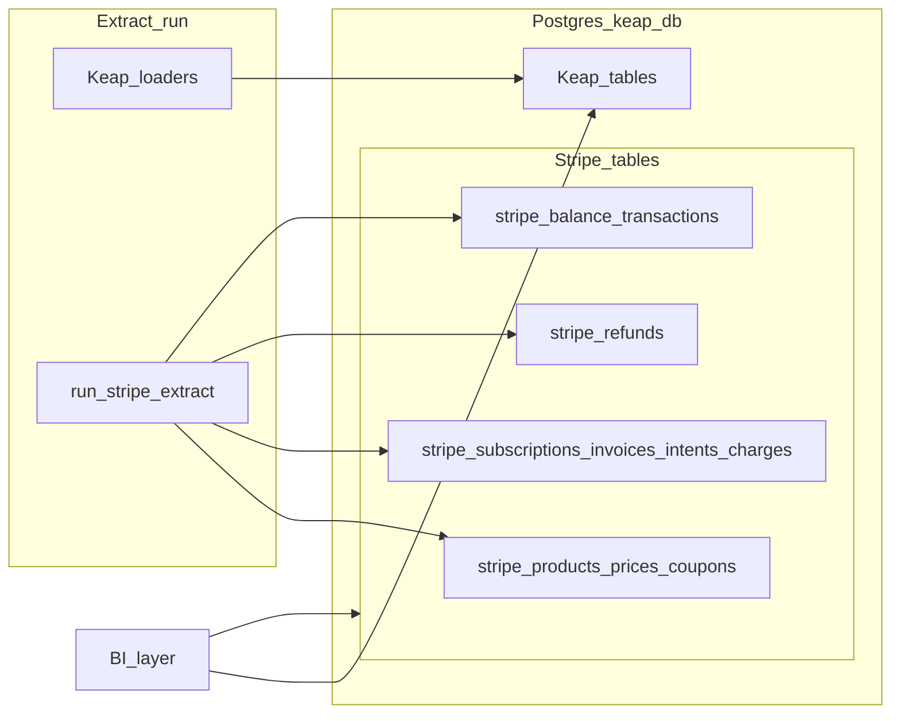

# Stripe BI (PostgreSQL extension)

This folder describes how **Stripe** data should be modeled in PostgreSQL and loaded alongside the existing Keap extract so reporting tools can use **gateway-level payments, subscriptions, invoicing, catalog dimensions, settlement, and refund detail** in the same database as CRM and order data.

**`stripe_charges`** remains the primary **payment-attempt fact** for card/network lifecycle and amounts. This milestone also includes **normalized dimensions** (`stripe_products`, `stripe_prices`, `stripe_coupons`), **additional facts** (`stripe_payment_intents`, `stripe_invoices`, `stripe_subscriptions`), **settlement** via `stripe_balance_transactions` (with payouts and transfers reachable through balance-transaction linkage and optional dedicated tables), and **`stripe_refunds`** as a first-class child dataset linked to charges. Keap stays the source for contacts, orders, and internal payment records; Stripe is the source for these objects.

## Documents

| Document | Purpose |
|----------|---------|
| [01-scope-and-requirements.md](01-scope-and-requirements.md) | Stripe BI milestone scope, credentials, Connect, incremental sync, idempotency |
| [02-schema-design.md](02-schema-design.md) | All `stripe_*` tables, columns, indexes, relationships |
| [03-extract-integration.md](03-extract-integration.md) | Multi-entity extract, `DataLoadManager`, load order, checkpoints, CLI |
| [04-bi-reporting-and-joins.md](04-bi-reporting-and-joins.md) | Source-of-truth matrix, joins within Stripe and to Keap, example SQL |

## Explicit exclusions

The following are **not** targeted by this documentation milestone (they may be added later if needed):

- Full **Stripe Tax** reporting artifacts, **Radar** fraud-rule analytics, **Capital**, and similar product-specific datasets beyond core payments and billing objects
- **Invoice line items** as a normalized table (line detail may live in `raw_payload` or a follow-on design unless you extend the schema)

## Architecture (high level)

## Related project docs

- [Database design (Keap core)](../04-database-design.md)
- [Data extraction design](../03-data-extraction-design.md)
